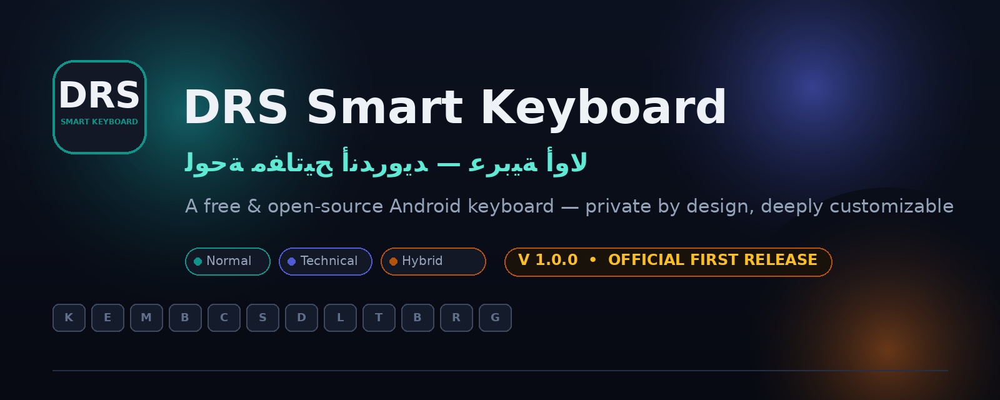

# DRS Smart Keyboard

**لوحة مفاتيح أندرويد حرة ومفتوحة المصدر — عربية أولًا، خاصة بالكامل، وقابلة للتخصيص بعمق**

A free and open-source keyboard for Android — Arabic-first, fully private, deeply customizable.

**[⬇️ تحميل أحدث إصدار | Download Latest Release](https://github.com/CTO-DRS/keyboard-drs-smart/releases/latest)**

---

## نبذة عن المشروع

**DRS Smart Keyboard** هو الإصدار الأول الرسمي من لوحة مفاتيح أندرويد متكاملة ومفتوحة المصدر، صُممت من الأساس لتكون **عربية أولًا** دون التنازل عن أي شيء لغير العربية: اتجاه RTL أصيل في كل شاشة، اقتراحات وتصحيح عربي، أشكال حروف محسوبة، وواجهة كاملة بالعربية والإنجليزية.

التطبيق مبني بتقنيات Android الحديثة (Kotlin + Jetpack Compose + Material 3)، ويعمل بموقع مستقل تمامًا: كل ما تكتبه وكل إعداداتك تبقى على جهازك، ولا تُرسل أي بيانات إلى أي جهة.

## لماذا DRS Smart Keyboard؟

- **عربية أولًا حقًا** — لا ترجمة لاحقة ولا واجهة معكوسة: تخطيطات عربية مدروسة، معاينة حية بالاتجاه الصحيح، وأرقام وتواريخ عربية.
- **ثلاثة أنظمة استخدام منفصلة** — بدل شاشة إعدادات واحدة مربكة، يحصل كل مستخدم على نظام كامل بملفه الشخصي وألوانه وعملته.
- **مركز حزم وتحديثات رسمي داخل التطبيق** — تنزيل السمات والحزم والتحديثات مباشرة، مع تحقق تشفيري SHA-256 لكل ملف.
- **خصوصية مطلقة** — بلا حسابات، بلا تتبع، بلا إعلانات؛ والاتصال الوحيد الممكن هو فحص التحديثات عبر GitHub.

## أبرز ما يميز المشروع

| | |
|---|---|
| 🎛️ **مركز تحكم موحد** | حالة لوحة المفاتيح، النظام الحالي، السمة، الإضافات، التحديثات — في مكان واحد |
| 🧑‍💻 **ثلاثة أنظمة مستخدمين** | عادي · تقني · متكامل، لكلٍّ إعداداته وتخطيطاته واختصاراته وملفه الشخصي |
| 🎨 **تخصيص عميق للسمات** | محرر سمات بمعاينة حية، ألوان وخلفيات وأشكال، وتدرجات جاهزة |
| 📦 **مركز حزم رسمي** | تصفح وتنزيل حزم السمات والتخطيطات والحزم اللغوية مع تحقق من السلامة |
| 🔄 **مركز تحديثات مدمج** | فحص وتنزيل وتثبيت أحدث إصدار من داخل التطبيق |
| 📋 **حافظة متكاملة** | سجل ذكي، تثبيت عناصر، فلاتر، وصور |
| ✍️ **كتابة ذكية** | اقتراحات، تصحيح، إيماءات تمرير، اختصارات نصية تشمل التاريخ الهجري |
| 🩺 **تشخيص ذاتي** | فحص شامل بنتيجة Pass/Warning/Error وأسباب الحلول، مع سجل أحداث تقني آمن |
| 💾 **نسخ احتياطي واستعادة** | إعداداتك وسماتك وملفاتك الشخصية في ملف واحد قابل للنقل |
| 🏆 **اقتصاد مكافآت حقيقي** | اكسب من الكتابة الفعلية، وخصص مظهر نظامك بعناصر حصرية |
| 🛠️ **أدوات نصوص متقدمة** | لوحة أدوات داخل لوحة المفاتيح: حالات الأحرف، تنظيف المسافات، إزالة التشكيل، وعمليات الأسطر |
| 📊 **مراقب أداء حقيقي** | قياس فعلي لزمن استجابة المحرك والذاكرة والتخزين — أرقام من النظام لا تقديرات |

## تجربة لوحة المفاتيح

- تخطيط عربي كامل مع صف أرقام قابل للإظهار، وشريط اقتراحات ذكي.
- إدخال بالسحب (Glide Typing)، إيماءات قابلة للتخصيص لكل مفتاح.
- رموز تعبيرية كاملة مع بحث وسجل ودرجات بشرة.
- شريط ذكي متطور: إجراءات سريعة، مرشحات حافظة، ولوحات مفاتيح مدمجة.
- وضع منفرد ووضع عائم للكتابة بيد واحدة.

## التخصيص

- **40+ سمة مدمجة** خمس عائلات، من «تراس DRS» إلى «ليلة عربية».
- **محرر سمات** بمعاينة حية: ألوان، خلفيات، أشكال أزرار، وحواف.
- سمات نهارية وليلية تلقائية حسب النظام أو الوقت.
- اختيار خطوط الشرح، حجم الأزرار، وعدد أعمدة الشبكات.

## نظام المستخدم التقني

- **لوحة أدوات النصوص** داخل لوحة المفاتيح (من الشريط التقني أو زر الأدوات): تحويل حالة الأحرف، تنظيف المسافات والأسطر، إزالة التشكيل، معالجة علامات الترقيم، ترتيب الأسطر، حذف سطر/حتى بداية أو نهاية السطر، وعدّ الأحرف والكلمات — كلها تعمل على النص المحدد أو الحقل كاملًا عبر InputConnection الحقيقي.
- **نظام اختصارات متقدم**: تعديل الاختصار القائم باسمه الجديد (بلا تكرارات)، تفعيل/تعطيل كل اختصار على حدة، ومتغير `{cursor}` لتحديد موضع المؤشر بعد الإدراج.
- **تخصيص الشريط التقني**: إخفاء أي مفتاح أو إعادة ترتيبه، والتغيير يُطبَّق مباشرة على الشريط.
- **مراقب أداء**: زمن معالجة كل ضغطة فعليًا (متوسط/95%/أقصى)، ذاكرة Java وNative، حجم ملف الحالة — قياسات حية بلا أرقام وهمية.
- **فحص شامل**: 19 فحصًا بنتيجة Pass/Warning/Error مع سبب كل خلل وطريقة إصلاحه.
- **سجل أحداث تقني**: في الذاكرة فقط، يُسجِّل نوع الخطأ ورمزه بلا أي نص مكتوب، مع مسح فوري.
- **نسخ احتياطي لحالة DRS**: تصدير/استيراد JSON عبر نافذة النظام مع فحص صلاحية يرفض الملفات التالفة قبل تطبيقها.

## أنظمة المستخدم الثلاثة

| النظام | لمن؟ | ماذا يوفر |
|---|---|---|
| 🌿 **العادي** | مستخدم يريد البساطة | كتابة سريعة، اقتراحات، حافظة ذكية، وبلا تعقيد |
| ⚡ **التقني** | عاشق التحكم | أدوات نصوص متقدمة، اختصارات بمؤشر مخصص، شريط تقني قابل للتخصيص، ومراقب أداء |
| ✦ **المتكامل** | يريد الاثنين معًا | كل قدرات النظامين في تجربة واحدة |

لكل نظام: ملف شخصي مستقل، ألوان هوية، عملة خاصة يُكتسب بالاستخدام الحقيقي، وحزمة ملحقات تُطبق بلمسة.

## الإضافات والحزم

مركز الإضافات يدير عائلات كاملة من المكونات: سمات، تخطيطات، حزم لغوية، موديولات ملحقات ذكية (13 موديولًا حقيقيًا يعمل داخل لوحة المفاتيح)، مع بحث فوري وشارات مصدر ومحرر مدمج للملفات. **مركز حزم DRS** يضيف كتالوجًا رسميًا من الحزم المنشورة على GitHub Releases — تُحمَّل وتُتحقق (حجم + SHA-256) ثم تُثبَّت في نظام الإضافات الأصلي.

## مركز التحديثات

فحص أحدث إصدار عبر واجهة GitHub الرسمية، عرض رقم الإصدار والحجم والتاريخ والوصف، تنزيل بشريط تقدم حقيقي مع إيقاف/استئناف، تحقق SHA-256 إلزامي مقابل `SHA256SUMS.txt`، ثم تثبيت بالمسار الرسمي لأندرويد. الفحص التلقائي اختياري (يومي/أسبوعي/يدوي) مع إشعار عند توفر إصدار. وتضم الشاشة شارة تعرض رقم الإصدار الهدف مباشرة، وبطاقة إرشاد «كيف أُحدّث التطبيق؟» بخطوات مختصرة تُنهي أي تعثر أثناء التثبيت.

## الخصوصية والأمان

- لا نجمع أي بيانات — اقرأ [سياسة الخصوصية](PRIVACY.md) الكاملة.
- الحزمة والتحديثات عبر HTTPS فقط، مع تحقق SHA-256 وحجم لكل ملف قبل التثبيت.
- لا تنفيذ لأي كود مُنزَّل: الحزم بيانات صرفة (سمات وتخطيطات) تستهلكها المحركات الأصلية.
- التطبيق يعمل بالكامل بدون إنترنت؛ الشبكة تُستخدم فقط للفحص والتنزيل.

## متطلبات التشغيل

- Android 8.0 (API 26) أو أحدث
- لا حاجة لأي خدمات Google

## التحميل

| المصدر | الرابط |
|---|---|
| 🚀 أحدث إصدار (مستقر دائمًا) | **[github.com/CTO-DRS/keyboard-drs-smart/releases/latest](https://github.com/CTO-DRS/keyboard-drs-smart/releases/latest)** |
| 📱 APK الحالي | `DRS-Smart-Keyboard-v1.23.0.apk` من صفحة الإصدار |
| 🔄 من داخل التطبيق | مركز تحديثات DRS — تحقق وتنزيل وتثبيت بلا خروج من التطبيق |

> ⚠️ **ثبّت ملف `.apk` فقط**: ملف `.aab` في صفحة الإصدار حزمة نشر لـ Google Play
> ولا يمكن تثبيته مباشرة على الأجهزة (تظهر رسالة «الحزمة تبدو غير صالحة»).
> للتحقق من سلامة التنزيل: الحجم الصحيح يظهر في ملف `SHA256SUMS.txt` المرفق
> بالإصدار، وبصمة SHA-256 تطابق ما فيه —
> إن اختلف أي منهما فالتنزيل غير مكتمل؛ أعِد تنزيل الملف من جديد.

جميع الملفات موقّعة بنفس مفتاح الإصدار، ومرفق ملف `SHA256SUMS.txt` للتحقق اليدوي.

## لقطات الشاشة

تُلتقط لقطات الواجهة الرسمية من **التطبيق الفعلي على جهاز حقيقي** ولا تُستخدم أي صور مولّدة أو مؤقتة — نشرُ صورة غير حقيقية يعارض مبدأ المشروع في الصدق الكامل.

جدول اللقطات المعتمدة (13 لقطة) ومواضعها الدقيقة داخل التطبيق موثّق في [دليل التقاط اللقطات](docs/SCREENSHOTS.md)، وتُضمَّن هنا مباشرة بعد التقاطها من الإصدار الرسمي:

| # | الشاشة | المسار داخل التطبيق |
|---|---|---|
| 1 | الشاشة الرئيسية | فتح التطبيق |
| 2 | لوحة المفاتيح العربية | أي حقل إدخال |
| 3 | الإعدادات الرئيسية | الرئيسية ← الإعدادات |
| 4 | تخصيص السمات | التخصيص ← السمات |
| 5 | محرر السمة بمعاينة حية | السمات ← تحرير |
| 6 | مركز الإضافات | النظام والتطبيق ← مركز الإضافات |
| 7 | مركز حزم DRS | مركز الإضافات ← مركز الحزم |
| 8 | مركز تحديثات DRS | مركز الإضافات ← التحديثات |
| 9 | الحافظة الذكية | شريط لوحة المفاتيح ← الحافظة |
| 10 | نظام المستخدم: العادي | مركز التحكم ← النظام العادي |
| 11 | نظام المستخدم: التقني | مركز التحكم ← النظام التقني |
| 12 | نظام المستخدم: المتكامل | مركز التحكم ← النظام المتكامل |
| 13 | حول التطبيق | أخرى ← حول |

## الترخيص

المشروع مرخّص بموجب [Apache License 2.0](LICENSE)، مع [إشعارات الطرف الثالث](THIRD_PARTY_NOTICES.md) للمكتبات المستخدمة.

## الدعم

- 🐞 المشاكل والاقتراحات: [مستكشف المشاكل](https://github.com/CTO-DRS/keyboard-drs-smart/issues)
- 📖 الكود المصدري: [هذا المستودع](https://github.com/CTO-DRS/keyboard-drs-smart)

---

## About | حول

**DRS Smart Keyboard** is a free and open-source Android keyboard built Arabic-first:
three usage systems (Casual / Technical / Integrated), a built-in official Package Center
and Update Center with mandatory SHA-256 verification, deep theme customization with live
preview, a rich clipboard manager, real reward economy, and absolute privacy — all data
stays on your device.

**[Download the latest release](https://github.com/CTO-DRS/keyboard-drs-smart/releases/latest)** ·
[License](LICENSE) · [Privacy Policy](PRIVACY.md)

Copyright © 2026 The DRS Smart Keyboard Project

